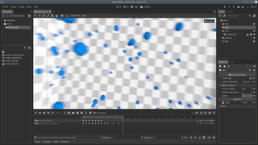

# Godot Motion Blur

This is a camera motion blur shader for Godot. It uses the linear and angular velocity of the camera to calculate a velocity vector per pixel, and then blurs that pixel accordingly. The velocity is automatically calculated from the way the camera moves and rotates, so it works for pretty any kind of camera animation you can think of. It can produce linear blur, angular blur, zooming blur, and any combination of them, depending on the camera's movement.

It looks like this:

[Here's a video of it in action.](https://www.youtube.com/watch?v=Du6_WYIRi5s)

# How to use it 
It's really easy to use in your project! Simply:

1. Download the repository as zip and extract it.
2. Copy the `motion_blur` folder into the root folder of your project.
3. In the scene of your game, select your camera node, and then click the chain icon above the scene tree to instance a scene,  then select the `motion_blur.tscn` scene file.
4. That's all!

# Limitations/Known Issues

- Only works for camera movement. When something else in the world moves it won't be blurred.
- Additionally, when the camera moves, and another object moves at the same speed of the camera, that object will be wrongly blurred. So e.g. in a racing game you'll notice the car will be blurred in the same way as the environment. You could work around this by enabling the Transparent flag in the material of the car, and setting the Depth Draw Mode to Always (since transparent objects are not blurred - see below).
- Transparent objects will not be blurred (since this effect uses the depth buffer, but transparent objects aren't drawn to he depth buffer, so they aren't detected)

# License
MIT
